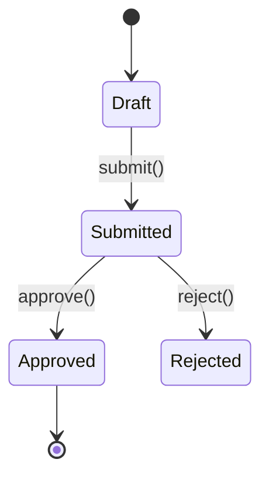
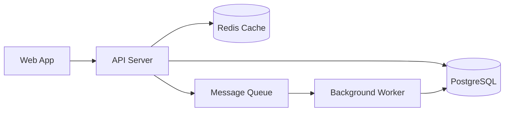

# Implementation Plan: [FEATURE]

**Branch**: `[###-feature-name]` | **Date**: [DATE] | **Spec**: [link]
**Input**: Feature specification from `/specs/[###-feature-name]/spec.md`

**Note**: This template is filled in by the `__SPECKIT_COMMAND_PLAN__` command. See `.specify/templates/plan-template.md` for the execution workflow.

## Summary

[Extract from feature spec: primary requirement + technical approach from research]

## Technical Context

<!--
  ACTION REQUIRED: Replace the content in this section with the technical details
  for the project. The structure here is presented in advisory capacity to guide
  the iteration process.
-->

**Language/Version**: [e.g., Python 3.11, Swift 5.9, Rust 1.75 or NEEDS CLARIFICATION]  
**Primary Dependencies**: [e.g., FastAPI, UIKit, LLVM or NEEDS CLARIFICATION]  
**Storage**: [if applicable, e.g., PostgreSQL, CoreData, files or N/A]  
**Testing**: [e.g., pytest, XCTest, cargo test or NEEDS CLARIFICATION]  
**Target Platform**: [e.g., Linux server, iOS 15+, WASM or NEEDS CLARIFICATION]
**Project Type**: [e.g., library/cli/web-service/mobile-app/compiler/desktop-app or NEEDS CLARIFICATION]  
**Performance Goals**: [domain-specific, e.g., 1000 req/s, 10k lines/sec, 60 fps or NEEDS CLARIFICATION]  
**Constraints**: [domain-specific, e.g., <200ms p95, <100MB memory, offline-capable or NEEDS CLARIFICATION]  
**Scale/Scope**: [domain-specific, e.g., 10k users, 1M LOC, 50 screens or NEEDS CLARIFICATION]

## Constitution Check

*GATE: Must pass before Phase 0 research. Re-check after Phase 1 design.*

[Gates determined based on constitution file]

## Architecture Design

<!--
  ACTION REQUIRED: Describe the module/component structure and their relationships.
  This section bridges the gap between technical context and file-level project structure.
-->

### Module/Component Overview

| Module/Component | Responsibility | Depends On | Exposes To |
|------------------|---------------|------------|------------|
| [Module A] | [What it does] | [Dependencies] | [Consumers] |
| [Module B] | [What it does] | [Dependencies] | [Consumers] |

### Module Relationships

```mermaid
[Describe or diagram module relationships. Example:]

graph TD
    CLI[CLI Layer] --> Service[Service Layer]
    Service --> Repo[Repo Layer]
    Service --> Models[(Models)]
    Repo --> Models
```

### Key Design Decisions

| Decision | Choice | Rationale | Alternatives Rejected |
|----------|--------|-----------|----------------------|
| [e.g., State management] | [e.g., Redux] | [Why] | [What else was considered] |
| [e.g., Communication] | [e.g., Events] | [Why] | [What else was considered] |

### State Machine *(optional — fill if feature involves state transitions)*

<!--
  ACTION REQUIRED: Only include this section if the feature has non-trivial state
  (e.g., order lifecycle, approval workflow, task states). Delete if not applicable.
-->

#### [Entity] States



**State Definitions**:

| State | Meaning | Allowed Transitions | Guard Conditions |
|-------|---------|--------------------|-------------------|
| Draft | [Initial state, what it means] | → Submitted | [Any preconditions] |
| Submitted | [What it means] | → Approved, → Rejected | [Any preconditions] |
| Approved | [What it means] | None (terminal) | — |
| Rejected | [What it means] | None (terminal) | — |

### Deployment Topology *(optional — fill if feature involves multiple runtime processes)*

<!--
  ACTION REQUIRED: Only include this section if the feature spans multiple processes,
  containers, or external services. Delete if single-process/simple architecture.
-->



| Component | Runtime | Protocol | Notes |
|-----------|---------|----------|-------|
| [API Server] | [e.g., Node.js process] | [e.g., HTTP/REST] | [Key details] |
| [Worker] | [e.g., Background process] | [e.g., AMQP via RabbitMQ] | [Key details] |

### Data Flow

<!--
  ACTION REQUIRED: Describe how data moves through the system.
  Focus on the critical paths — the main user journeys and their data pipelines.
-->

#### Critical Path: [Journey Name]

```mermaid
[Describe data flow. Example:]

sequenceDiagram
    participant U as User
    participant G as API Gateway
    participant A as Auth Check
    participant S as Service
    participant C as Cache Layer
    participant DB as Database

    U->>G: Request
    G->>A: Authenticate
    A-->>G: OK
    G->>S: Forward
    S->>C: Check cache
    C-->>S: Miss
    S->>DB: Query
    DB-->>S: Result
    S-->>G: Response
    G-->>U: Return
```

1. **[Step 1]**: [What happens, which module handles it]
2. **[Step 2]**: [What happens, which module handles it]
3. **[Step 3]**: [What happens, which module handles it]

[Add more critical paths as needed]

### Cross-Cutting Concerns

- **Error Handling**: [How errors propagate across modules]
- **Logging/Observability**: [What gets logged and where]
- **Security**: [Auth boundaries, data sanitization points]

## Project Structure

### Documentation (this feature)

```text
specs/[###-feature]/
├── plan.md              # This file (__SPECKIT_COMMAND_PLAN__ command output)
├── research.md          # Phase 0 output (__SPECKIT_COMMAND_PLAN__ command)
├── data-model.md        # Phase 1 output (__SPECKIT_COMMAND_PLAN__ command)
├── quickstart.md        # Phase 1 output (__SPECKIT_COMMAND_PLAN__ command)
├── contracts/           # Phase 1 output (__SPECKIT_COMMAND_PLAN__ command)
└── tasks.md             # Phase 2 output (__SPECKIT_COMMAND_TASKS__ command - NOT created by __SPECKIT_COMMAND_PLAN__)
```

### Source Code (repository root)
<!--
  ACTION REQUIRED: Replace the placeholder tree below with the concrete layout
  for this feature. Delete unused options and expand the chosen structure with
  real paths (e.g., apps/admin, packages/something). The delivered plan must
  not include Option labels.
-->

```text
# [REMOVE IF UNUSED] Option 1: Single project (DEFAULT)
src/
├── models/
├── services/
├── cli/
└── lib/

tests/
├── contract/
├── integration/
└── unit/

# [REMOVE IF UNUSED] Option 2: Web application (when "frontend" + "backend" detected)
backend/
├── src/
│   ├── models/
│   ├── services/
│   └── api/
└── tests/

frontend/
├── src/
│   ├── components/
│   ├── pages/
│   └── services/
└── tests/

# [REMOVE IF UNUSED] Option 3: Mobile + API (when "iOS/Android" detected)
api/
└── [same as backend above]

ios/ or android/
└── [platform-specific structure: feature modules, UI flows, platform tests]
```

**Structure Decision**: [Document the selected structure and reference the real
directories captured above]

## Complexity Tracking

> **Fill ONLY if Constitution Check has violations that must be justified**

| Violation | Why Needed | Simpler Alternative Rejected Because |
|-----------|------------|-------------------------------------|
| [e.g., 4th project] | [current need] | [why 3 projects insufficient] |
| [e.g., Repository pattern] | [specific problem] | [why direct DB access insufficient] |
